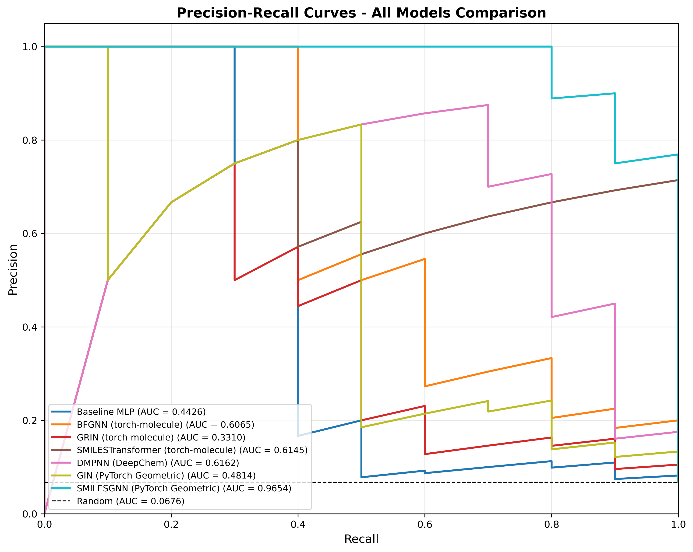
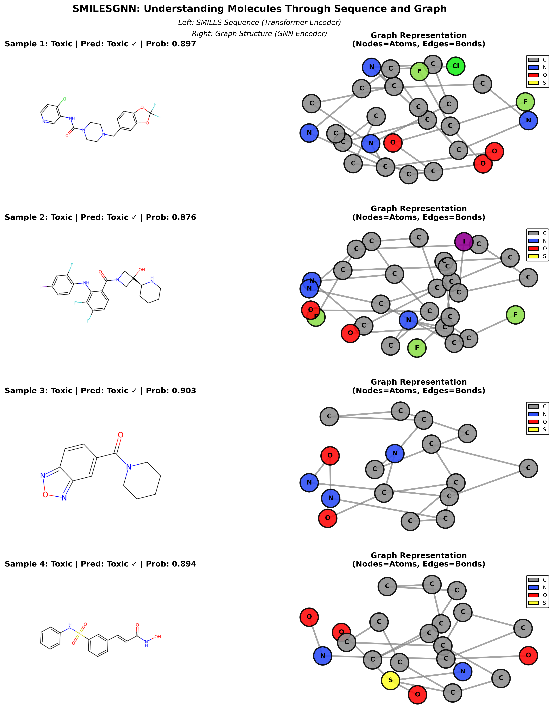

# SMILESGNN: Clinical Toxicity Prediction via Multimodal Molecular Fusion

Implementation of **SMILESGNN**, a multimodal deep learning architecture for clinical drug toxicity prediction, combining SMILES sequence encoding (Transformer) with molecular graph encoding (GATv2) through an attention-based fusion mechanism.

> Nguyen et al., *"Advancing Clinical Toxicity Prediction Through Multimodal Fusion of SMILES Sequences and Molecular Graph Representation"*, CITA 2026.

---

## Results

Evaluated on the [ClinTox](https://moleculenet.org/datasets-1) dataset (1,480 molecules, scaffold-based split, 11.5:1 class imbalance).

| Model | AUC-ROC | Accuracy | F1 | AUPRC |
|---|---|---|---|---|
| Baseline MLP (Morgan FP) | 0.717 | 0.939 | 0.471 | 0.450 |
| GRIN | 0.823 | 0.946 | 0.429 | 0.379 |
| GIN | 0.864 | 0.953 | 0.588 | 0.503 |
| GATv2 | 0.885 | 0.892 | 0.385 | 0.466 |
| DMPNN | 0.886 | 0.867 | 0.333 | 0.596 |
| BFGNN | 0.919 | 0.939 | 0.182 | 0.616 |
| SMILESTransformer | 0.980 | 0.966 | 0.783 | 0.665 |
| **SMILESGNN** | **0.997** | **0.980** | **0.870** | **0.967** |




---

## Architecture

SMILESGNN processes each molecule through two parallel encoders whose outputs are fused via cross-attention:

```
SMILES string ──► Transformer Encoder (2 layers, d=96, 4 heads) ──► h_SMILES ∈ ℝ⁹⁶
                                                                           │
                                                                    Cross-Attention
                                                                    (SMILES=query,
Molecular graph ──► GATv2 Encoder (3 layers, 4 heads, JK) ──────►  graph=key/value) ──► h_fused ∈ ℝ¹⁹² ──► MLP ──► P(toxic)
                    Mean-Max pool → h_graph ∈ ℝ⁵⁷⁶
```

**Key hyperparameters** (see `config/smilesgnn_config.yaml`):

| Component | Setting |
|---|---|
| SMILES vocab / max length | 100 / 128 tokens |
| Transformer layers / heads / d_ff | 2 / 4 / 192 |
| GATv2 layers / heads / hidden | 3 / 4 / 96 |
| Node features / Edge features | 25 / 17 |
| Jumping Knowledge mode | concatenation |
| Graph pooling | mean + max |
| Fusion | cross-attention (4 heads) |
| Loss | Focal Loss (α=0.25, γ=2.0) |
| Optimizer | AdamW (lr=5e-4, wd=1e-4) |
| Regularization | Dropout=0.4, BatchNorm, weighted sampler |
| Early stopping | patience=15, monitor=val-F1 |



---

## Project Structure

```
molecule/
├── src/                          # Core library
│   ├── data.py                   # ClinTox loading with scaffold split
│   ├── featurization.py          # Morgan fingerprints & graph features
│   ├── smiles_tokenizer.py       # Custom SMILES tokenizer
│   ├── graph_data.py             # RDKit → PyG Data (25 node, 17 edge features)
│   ├── graph_models_hybrid.py    # SMILESGNN architecture ⭐
│   ├── graph_models.py           # GATv2 standalone
│   ├── graph_models_gin.py       # GIN standalone
│   ├── graph_train.py            # Training loop (Focal Loss, early stopping)
│   ├── models.py                 # Baseline MLP + torch-molecule wrappers
│   ├── train.py                  # Training for baseline models
│   ├── pipelines.py              # High-level training pipelines
│   ├── explain.py                # Gradient & perturbation attribution
│   ├── gnn_explainer.py          # GNNExplainer integration ⭐
│   ├── inference.py              # Batch inference engine (used by app.py)
│   ├── viz.py                    # RDKit molecular visualization
│   ├── analysis.py               # Metrics and error analysis
│   └── utils.py                  # Seeds, config, metrics
│
├── scripts/                      # Training & evaluation scripts
│   ├── train_hybrid.py           # Train SMILESGNN ⭐
│   ├── explain_smilesgnn.py      # GNNExplainer CLI ⭐
│   ├── train_gatv2.py            # Train GATv2 baseline
│   ├── train_gin.py              # Train GIN baseline
│   ├── consolidate_results.py    # Merge metrics from all models
│   └── generate_curves.py        # Reproduce ROC/PR curve figures
│
├── notebooks/                    # Interactive workflows
│   ├── 01_data_exploration.ipynb           # Dataset overview & scaffold split
│   ├── 02_training_baseline.ipynb          # Baseline MLP (Morgan FP)
│   ├── 03_training_gnn.ipynb               # BFGNN (torch-molecule + Optuna)
│   ├── 03_training_grin.ipynb              # GRIN (torch-molecule + Optuna)
│   ├── 03_training_smilestransformer.ipynb # SMILESTransformer (torch-molecule + Optuna)
│   ├── 07_gnnexplainer.ipynb               # GNNExplainer attribution ⭐
│   └── 08_inference.ipynb                  # Programmatic inference walkthrough ⭐
│
├── config/                       # Model hyperparameter configs (YAML)
│   ├── smilesgnn_config.yaml     # SMILESGNN ⭐
│   ├── gatv2_config.yaml
│   └── gin_config.yaml
│
├── test_data/                    # Demo files for the Streamlit app
│   ├── screening_library.csv     # 30 compounds (balanced) — main demo ⭐
│   ├── toxic_compounds.csv       # All 10 confirmed-toxic molecules
│   ├── reference_panel.csv       # Famous drugs (Thalidomide, Aspirin …)
│   ├── with_parse_errors.csv     # Edge-case chemistry (organometallics)
│   ├── smiles_only.csv           # Minimal CSV — SMILES column only
│   ├── named_compounds.txt       # SMILES<TAB>name format
│   └── README.md                 # File descriptions & suggested test order
│
├── results/
│   └── overall_results.csv       # Full benchmark table
│
├── assets/                       # Figures for this README
│   ├── roc_curves.png
│   ├── pr_curves.png
│   ├── smiles_graph_pairs.png
│   ├── molecular_graphs.png
│   ├── model_performance.png
│   └── confusion_matrices.png
│
├── app.py                        # Streamlit inference app ⭐
├── environment.yml               # Conda environment (recommended)
├── requirements.txt              # Pip requirements
└── .gitignore
```

> **Runtime directories** `data/` and `models/` are created automatically during training and excluded from version control.

---

## Setup

### Option A — Conda (recommended)

```bash
# 1. Create and activate environment
conda env create -f environment.yml
conda activate drug-tox-env

# 2. Install Jupyter kernel
python -m ipykernel install --user --name drug-tox-env --display-name "Python (drug-tox-env)"
```

### Option B — Pip (Linux/CUDA)

```bash
# 1. PyTorch with CUDA 12.1
pip install torch==2.4.0 --index-url https://download.pytorch.org/whl/cu121

# 2. PyTorch Geometric (must match torch version)
pip install torch-scatter torch-geometric \
    -f https://data.pyg.org/whl/torch-2.4.0+cu121.html

# 3. RDKit
conda install rdkit -c conda-forge   # or: pip install rdkit-pypi

# 4. All other dependencies
pip install -r requirements.txt
```

**CPU-only:** replace `cu121` with `cpu` in both URLs above.

**Verified environment:** Python 3.11, PyTorch 2.4.0+cu121, torch-geometric 2.7.0, CUDA 12.1 (NVIDIA RTX 3060).

---

## Reproducing Results

### SMILESGNN (main model)

```bash
python scripts/train_hybrid.py --device cuda
# CPU: python scripts/train_hybrid.py --device cpu
```

Output saved to `models/smilesgnn_model/`:
- `best_model.pt` — model weights (best validation F1)
- `tokenizer.pkl` — fitted SMILES tokenizer
- `smilesgnn_model_metrics.txt` — test metrics
- `training_curves.png` — loss / AUC-ROC / F1 history

**Expected results** (stochastic; AUC-ROC and AUPRC are stable across runs):

| Metric | Paper | Typical range |
|---|---|---|
| AUC-ROC | 0.997 | 0.993–0.997 |
| AUPRC | 0.967 | 0.950–0.967 |
| F1 | 0.870 | 0.818–0.870 |
| Accuracy | 0.980 | 0.973–0.980 |

> Small F1/accuracy variance (~0.05) is expected: the test set contains only **10 toxic samples**, so a single prediction flip changes F1 by ~0.05.

### GATv2 and GIN baselines

```bash
python scripts/train_gatv2.py --device cuda
python scripts/train_gin.py   --device cuda
```

### Baseline MLP and torch-molecule models

Run the notebooks in order (requires Jupyter):

```bash
jupyter notebook
```

| Notebook | Model | Notes |
|---|---|---|
| `02_training_baseline.ipynb` | Baseline MLP | ~2 min |
| `03_training_gnn.ipynb` | BFGNN | ~1–2h (Optuna, 20 trials) |
| `03_training_grin.ipynb` | GRIN | ~1–2h (Optuna, 20 trials) |
| `03_training_smilestransformer.ipynb` | SMILESTransformer | ~1–2h (Optuna, 20 trials) |

### Consolidate all results and regenerate figures

```bash
python scripts/consolidate_results.py
python scripts/generate_curves.py
```

---

## Streamlit Inference App

After training SMILESGNN, launch the interactive toxicity predictor:

```bash
conda activate drug-tox-env
cd /path/to/molecule
streamlit run app.py
```

The app opens at `http://localhost:8501` and provides two tabs:

---

### Tab 1 — Batch Screening

Score an entire compound library and rank by P(toxic).

**Input options:**
- **Upload a file** — CSV, XLSX, or TXT (see `test_data/` for ready-made examples)
- **Paste SMILES** — one per line, optionally `SMILES<TAB>name`

**File format requirements:**

| Format | Required column | Optional columns |
|---|---|---|
| CSV / XLSX | `smiles` (case-insensitive) | `name`, `label` / `ct_tox` |
| TXT | One SMILES per line | `SMILES<TAB>name` per line |

**Output:**
- Summary metrics: screened / flagged toxic / passed / parse errors
- Probability distribution histogram (coloured by true label if provided)
- Pie chart of flagged vs. passed at the chosen threshold
- Ranked results table (toxic rows highlighted in red)
- CSV download of full results

**Quick demo:**
```
Upload → test_data/screening_library.csv
Expected: ~10 flagged toxic, ~20 passed, AUC-ROC ≈ 0.997
```

**Sidebar controls:**
| Control | Default | Effect |
|---|---|---|
| Decision threshold | 0.5 | P(toxic) ≥ threshold → flagged as Toxic |
| GNNExplainer epochs | 200 | Controls attribution quality in Tab 2 |

---

### Tab 2 — Deep Dive (Explain)

Explain **why** the model flags a single compound, with atom- and bond-level importance scores from GNNExplainer.

**Workflow:**
1. Click a quick-fill button (Thalidomide, 5-FU, Aspirin, Caffeine) **or** type any SMILES
2. Click **Predict + Explain**
3. Stage A — instant toxicity prediction (P(toxic), red/green banner)
4. Stage B — GNNExplainer runs on the graph pathway and produces:
   - Two-panel atom/bond heatmap (red = high importance, green = low)
   - Full atom importance table (element, hybridization, ring membership, aromaticity)
   - Top-10 bond importance table
   - CSV download for both tables

> **Note:** GNNExplainer explains the **GATv2 graph pathway only**. The SMILES Transformer embedding is frozen per molecule. Treat atom/bond scores as structural hypotheses rather than definitive attributions.

---

## Explainability

### GNNExplainer — CLI

For scripted or batch explanation without the UI:

```bash
# Single molecule
python scripts/explain_smilesgnn.py \
    --smiles "O=C1CCC(=O)N1c1ccc2c(c1)C(=O)N(C2=O)" \
    --device cuda

# Save PNG to disk
python scripts/explain_smilesgnn.py \
    --smiles "O=C1CCC(=O)N1c1ccc2c(c1)C(=O)N(C2=O)" \
    --save-dir output/explanations --device cuda

# Batch: all toxic molecules in the test split
python scripts/explain_smilesgnn.py \
    --split test --label-filter 1 \
    --element-chart --save-dir output/explanations
```

**Key flags:**

| Flag | Default | Description |
|---|---|---|
| `--smiles` | — | Single SMILES (mutually exclusive with `--split`) |
| `--split` | — | Dataset split: `train`, `val`, or `test` |
| `--label-filter` | None | `1` = toxic only, `0` = non-toxic only |
| `--target-class` | 1 | Class to explain (1 = toxic) |
| `--epochs` | 200 | GNNExplainer optimisation steps |
| `--device` | cpu | `cpu` or `cuda` |
| `--save-dir` | None | Save PNGs (interactive display if omitted) |
| `--element-chart` | off | Also produce element-level importance bar chart |

### GNNExplainer — Notebook

```bash
jupyter notebook notebooks/07_gnnexplainer.ipynb
```

Step-by-step walkthrough: load the trained model → explain Thalidomide →
batch-explain all toxic test molecules → aggregate element-level importance
scores to identify shared structural alerts.

### Programmatic Inference

```bash
jupyter notebook notebooks/08_inference.ipynb
```

Demonstrates the `src/inference.py` API directly:
- `load_model()` — load checkpoint + tokenizer
- `predict_batch()` — batch score a list of SMILES → ranked DataFrame
- Integrated pipeline: batch predict → explain top toxic hits


---

## Citation

```bibtex
@inproceedings{nguyen2026smilesgnn,
  title     = {Advancing Clinical Toxicity Prediction Through Multimodal Fusion
               of SMILES Sequences and Molecular Graph Representation},
  author    = {Nguyen, Thuy-Quynh and Nguyen, Trong-Nghia and Nguyen, Quang-Minh
               and Le, Duc-Minh and Ho, Nhat-Minh Nguyen and Doan, Thanh-Long Dai},
  year      = {2026}
}
```

---

## License

This project is released for research use. The ClinTox dataset is part of [MoleculeNet](https://moleculenet.org/) (MIT License).
