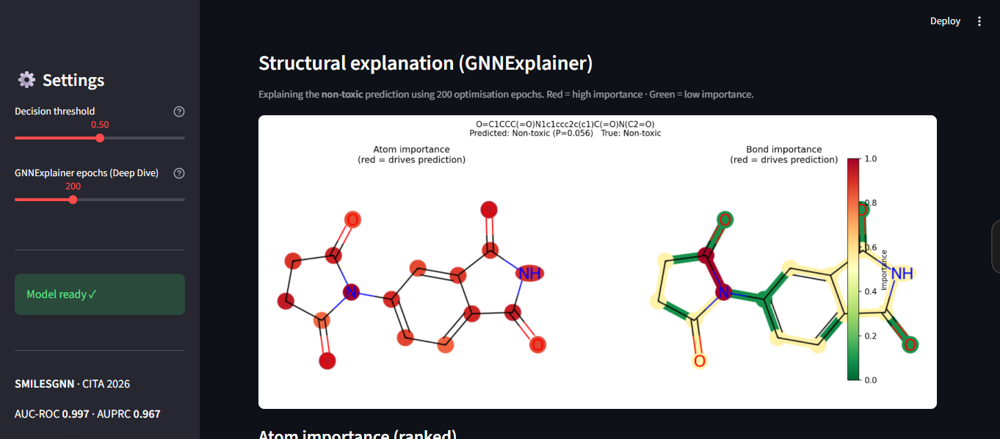

# SMILESGNN: Clinical Toxicity Prediction via Multimodal Molecular Fusion

Implementation of **SMILESGNN**, a multimodal deep learning architecture for clinical drug toxicity prediction, combining SMILES sequence encoding (Transformer) with molecular graph encoding (GATv2) through an attention-based fusion mechanism.

> Nguyen et al., *"Advancing Clinical Toxicity Prediction Through Multimodal Fusion of SMILES Sequences and Molecular Graph Representation"*, CITA 2026.

---

## Results

Evaluated on the [ClinTox](https://moleculenet.org/datasets-1) dataset (1,480 molecules, scaffold-based split, 11.5:1 class imbalance).

| Model | AUC-ROC | Accuracy | F1 | AUPRC |
|---|---|---|---|---|
| Baseline MLP (Morgan FP) | 0.717 | 0.939 | 0.471 | 0.450 |
| GRIN | 0.823 | 0.946 | 0.429 | 0.379 |
| GIN | 0.864 | 0.953 | 0.588 | 0.503 |
| GATv2 | 0.885 | 0.892 | 0.385 | 0.466 |
| DMPNN | 0.886 | 0.867 | 0.333 | 0.596 |
| BFGNN | 0.919 | 0.939 | 0.182 | 0.616 |
| SMILESTransformer | 0.980 | 0.966 | 0.783 | 0.665 |
| **SMILESGNN** | **0.997** | **0.980** | **0.870** | **0.967** |

---

## Model Explainability & Demo Workflow ⭐

SMILESGNN goes beyond prediction by offering deep-dive interpretation using **GNNExplainer**. We aim to explain **why** the model flags a single compound, providing atom- and bond-level importance scores.

### Demo Workflow: Input -> Predict -> Explain
The typical evaluation workflow consists of 3 stages:
1. **Input**: Provide a raw SMILES string (e.g., Thalidomide `O=C1CCC(=O)N1c1ccc2c(c1)C(=O)N(C2=O)`).
2. **Prediction**: The model calculates the clinical toxicity probability ($P(toxic)$).
3. **Interpretation (GNNExplainer)**: The GNNExplainer algorithm runs on the graph pathway to generate a heatmap showcasing the Top-10 atoms/bonds that contributed to this prediction.

### Current Limitations of GNNExplainer
The current explainability module is under active research and has several limitations that should be noted during interpretation:
1. **Prediction Inconsistency (Optimisation Noise)**: GNNExplainer optimizes binary masks over node features and edges. This optimization can introduce noise that temporarily affects the final prediction result (e.g., outputting $P(toxic) \approx 0.05$ for Thalidomide during the explanation phase, despite being correctly classified by the original model). High `epochs` (e.g., $\ge 500$) are required for stable masks.
2. **Graph-only Explanation (Frozen SMILES)**: GNNExplainer only attributes importance to the GATv2 graph pathway. The SMILES Transformer embedding is frozen per molecule. If the SMILES encoder predominantly drives the model's decision, the atom/bond scores on the graph might be misleading.
3. **No Chemical Constraints**: The algorithm optimizes purely for mathematical attribution, which can sometimes highlight chemically implausible subgraphs.

### Deep Dive (Streamlit UI)
To launch the interactive toxicity predictor with the Deep Dive explanation tab:
```bash
conda activate drug-tox-env
streamlit run app.py
```
Go to **Tab 2 — Deep Dive (Explain)**:
1. Click a quick-fill button (Thalidomide, 5-FU, Aspirin, Caffeine) **or** type any SMILES
2. Click **Predict + Explain**
3. Stage A — instant toxicity prediction (P(toxic), red/green banner)
4. Stage B — GNNExplainer runs on the graph pathway and produces:
   - Two-panel atom/bond heatmap (red = high importance, green = low)
   - Full atom importance table (element, hybridization, ring membership, aromaticity)
   - Top-10 bond importance table

### GNNExplainer — CLI
For scripted or batch explanation without the UI:
```bash
# Single molecule
python scripts/explain_smilesgnn.py \
    --smiles "O=C1CCC(=O)N1c1ccc2c(c1)C(=O)N(C2=O)" \
    --device cuda

# Batch: all toxic molecules in the test split
python scripts/explain_smilesgnn.py \
    --split test --label-filter 1 \
    --element-chart --save-dir output/explanations
```

### GNNExplainer — Notebook
Step-by-step walkthrough: load the trained model -> explain Thalidomide -> batch-explain all toxic test molecules -> aggregate element-level importance scores to identify shared structural alerts.
```bash
jupyter notebook notebooks/07_gnnexplainer.ipynb
```

---

## Architecture

SMILESGNN processes each molecule through two parallel encoders whose outputs are fused via cross-attention:

```
SMILES string ──► Transformer Encoder (2 layers, d=96, 4 heads) ──► h_SMILES ∈ ℝ⁹⁶
                                                                           │
                                                                    Cross-Attention
                                                                    (SMILES=query,
Molecular graph ──► GATv2 Encoder (3 layers, 4 heads, JK) ──────►  graph=key/value) ──► h_fused ∈ ℝ¹⁹² ──► MLP ──► P(toxic)
                    Mean-Max pool → h_graph ∈ ℝ⁵⁷⁶
```

**Key hyperparameters** (see `config/smilesgnn_config.yaml`):

| Component | Setting |
|---|---|
| SMILES vocab / max length | 100 / 128 tokens |
| Transformer layers / heads / d_ff | 2 / 4 / 192 |
| GATv2 layers / heads / hidden | 3 / 4 / 96 |
| Node features / Edge features | 25 / 17 |
| Jumping Knowledge mode | concatenation |
| Graph pooling | mean + max |
| Fusion | cross-attention (4 heads) |
| Loss | Focal Loss (α=0.25, γ=2.0) |
| Optimizer | AdamW (lr=5e-4, wd=1e-4) |
| Regularization | Dropout=0.4, BatchNorm, weighted sampler |
| Early stopping | patience=15, monitor=val-F1 |



---

## Project Structure

```
molecule/
├── src/                          # Core library
│   ├── data.py                   # ClinTox loading
│   ├── graph_models_hybrid.py    # SMILESGNN architecture ⭐
│   ├── gnn_explainer.py          # GNNExplainer integration ⭐
│   ├── inference.py              # Batch inference engine (used by app.py)
│   └── ...
│
├── scripts/                      # Training & evaluation scripts
│   ├── train_hybrid.py           # Train SMILESGNN ⭐
│   ├── explain_smilesgnn.py      # GNNExplainer CLI ⭐
│   └── ...
│
├── notebooks/                    # Interactive workflows
│   ├── 07_gnnexplainer.ipynb               # GNNExplainer attribution ⭐
│   ├── 08_inference.ipynb                  # Programmatic inference walkthrough ⭐
│   └── ...
│
├── config/                       # Model hyperparameter configs (YAML)
│   └── smilesgnn_config.yaml     # SMILESGNN ⭐
│
├── test_data/                    # Demo files for the Streamlit app
│   ├── screening_library.csv     # 30 compounds (balanced) — main demo ⭐
│   └── ...
│
├── assets/                       # Figures for this README
├── app.py                        # Streamlit inference app ⭐
├── environment.yml               # Conda environment (recommended)
└── requirements.txt              # Pip requirements
```

---

## Setup

### Option A — Conda (recommended)
```bash
conda env create -f environment.yml
conda activate drug-tox-env
python -m ipykernel install --user --name drug-tox-env --display-name "Python (drug-tox-env)"
```

### Option B — Pip (Linux/CUDA)
```bash
pip install torch==2.4.0 --index-url https://download.pytorch.org/whl/cu121
pip install torch-scatter torch-geometric -f https://data.pyg.org/whl/torch-2.4.0+cu121.html
conda install rdkit -c conda-forge
pip install -r requirements.txt
```

---

## Reproducing Results

**SMILESGNN (main model)**
```bash
python scripts/train_hybrid.py --device cuda
```
Output saved to `models/smilesgnn_model/`.

**Consolidate all results and regenerate figures**
```bash
python scripts/consolidate_results.py
python scripts/generate_curves.py
```

---

## Streamlit Inference App
After training SMILESGNN, launch the interactive toxicity predictor:
```bash
conda activate drug-tox-env
streamlit run app.py
```

### Tab 1 — Batch Screening
Score an entire compound library and rank by P(toxic).
- Upload CSV, XLSX, or TXT (e.g., `test_data/screening_library.csv`)
- Paste SMILES one per line.
- Outputs summary metrics, uncalibrated probability histogram, pie charts, and ranked downloadable CSV.

---

## Citation
```bibtex
@inproceedings{nguyen2026smilesgnn,
  title     = {Advancing Clinical Toxicity Prediction Through Multimodal Fusion
               of SMILES Sequences and Molecular Graph Representation},
  author    = {Nguyen, Thuy-Quynh and Nguyen, Trong-Nghia and Nguyen, Quang-Minh
               and Le, Duc-Minh and Ho, Nhat-Minh Nguyen and Doan, Thanh-Long Dai},
  year      = {2026}
}
```

---

## License
This project is released for research use. The ClinTox dataset is part of [MoleculeNet](https://moleculenet.org/) (MIT License).
