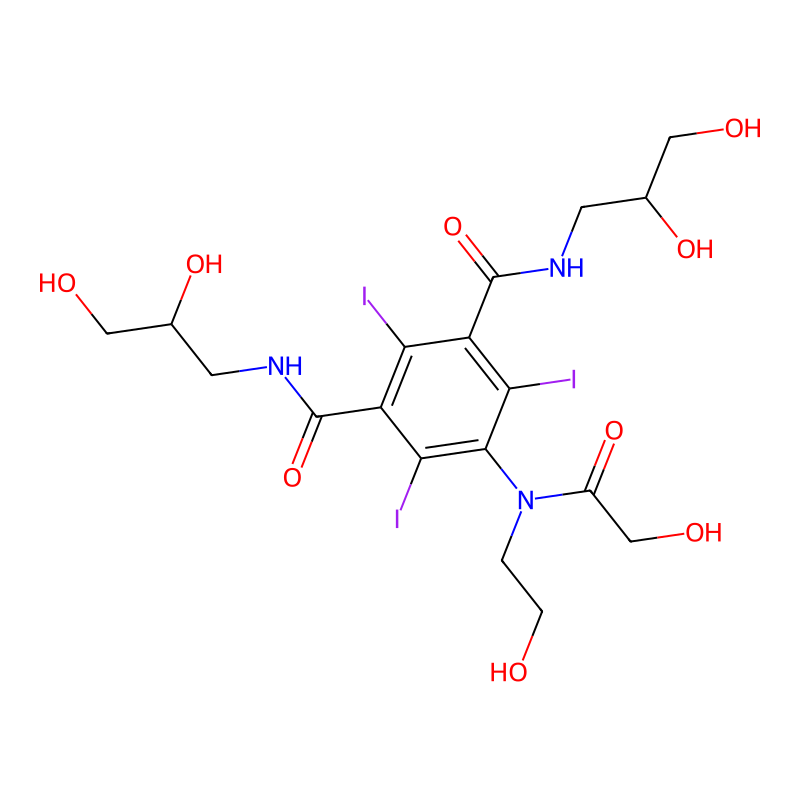
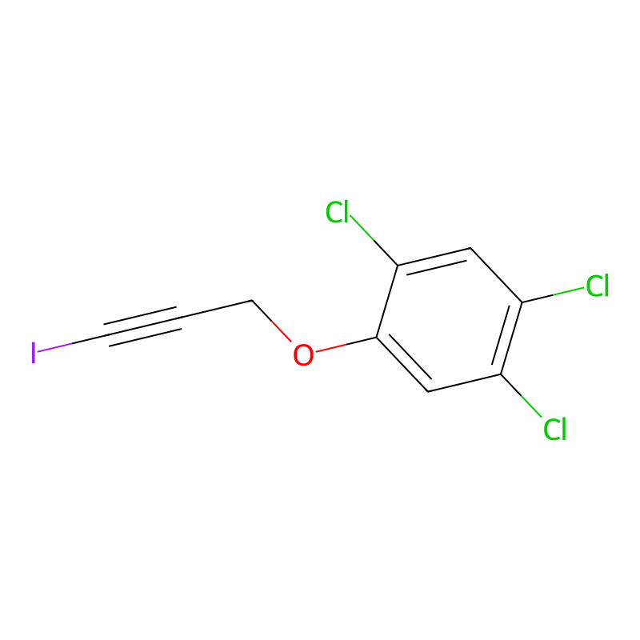
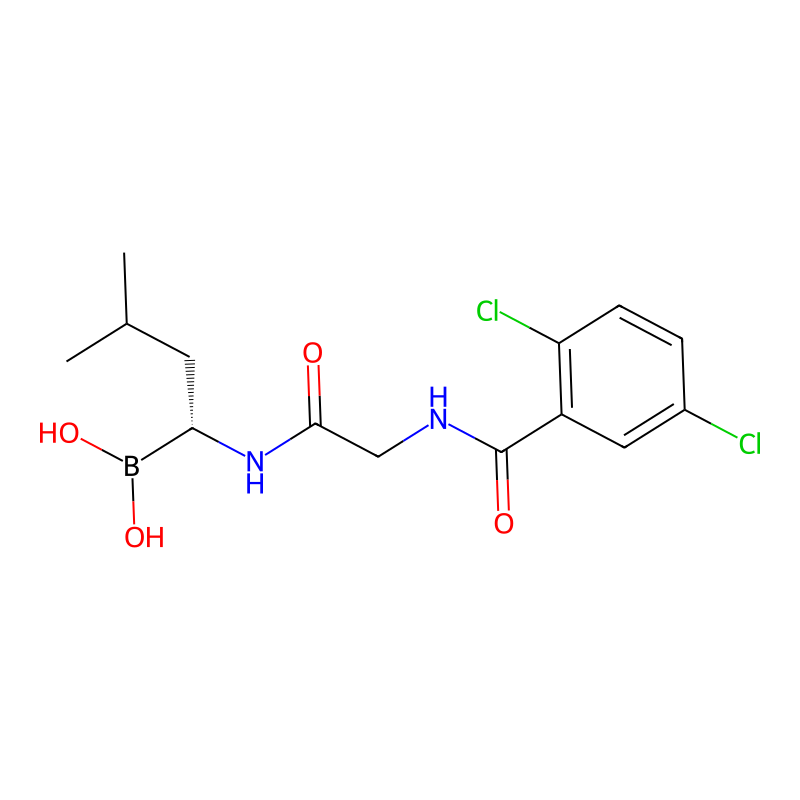
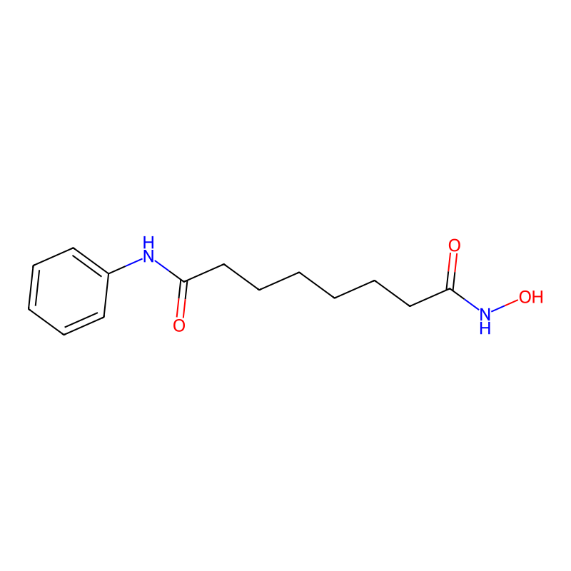
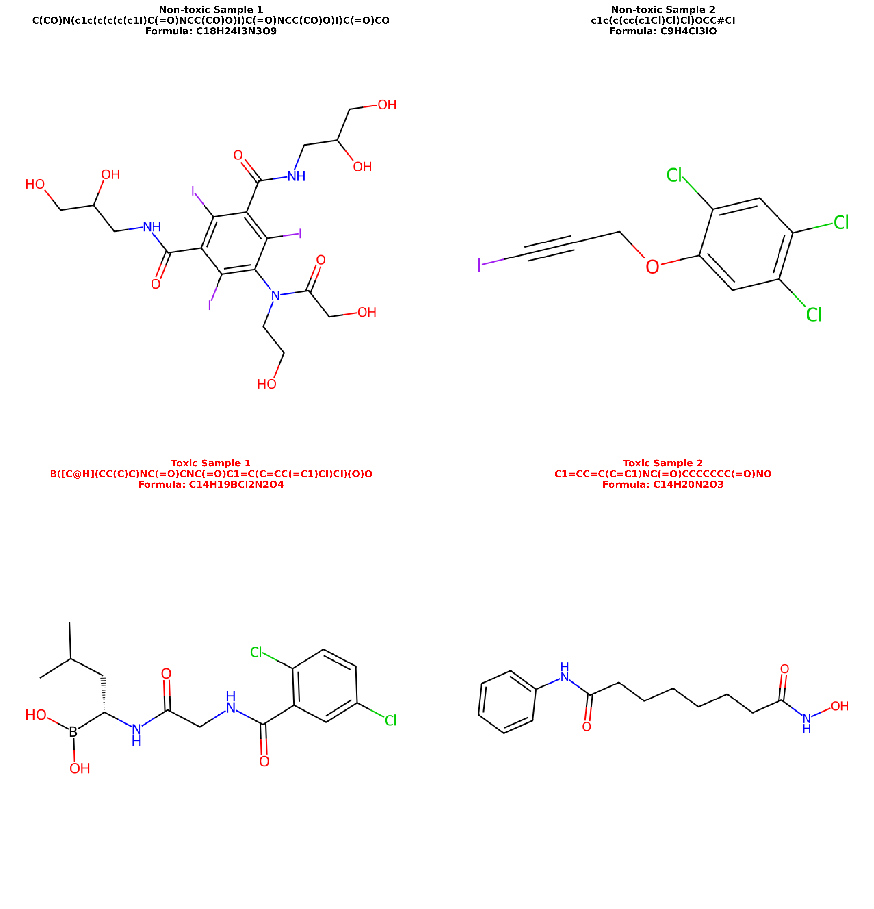

# Research Idea: Clinical Drug Toxicity Prediction

## Original Dataset: ClinTox

### Dataset Overview

**ClinTox** is a binary classification dataset designed to distinguish between FDA-approved drugs and drugs that failed clinical trials due to toxicity concerns. It is part of the MoleculeNet benchmark suite and is widely used for molecular property prediction tasks.

### Dataset Source

The dataset is accessed through:
- **Primary Source**: [DeepChem MoleculeNet](https://github.com/deepchem/deepchem/tree/master/deepchem/molnet/load_function/clintox.py)
- **Alternative Source**: [PyTDC (Therapeutics Data Commons)](https://tdcommons.ai/single_pred_tasks/tox.html#clintox)
- **Original Paper**: MoleculeNet: A Benchmark for Molecular Machine Learning (Wu et al., 2018)

### Dataset Characteristics

#### 1. Task Definition

ClinTox contains **two binary classification tasks**:
- **FDA_APPROVED**: Whether a drug was approved by the FDA (0 = not approved, 1 = approved)
- **CT_TOX**: Whether a drug failed clinical trials due to toxicity (0 = non-toxic, 1 = toxic)

**Our Focus**: We focus on the **CT_TOX** task, predicting clinical toxicity to identify drugs that are likely to fail clinical trials due to safety concerns.

#### 2. Dataset Statistics

```
┌─────────────────────────────────────────────────────────────┐
│                    ClinTox Dataset                           │
│              Clinical Toxicity Classification                │
└─────────────────────────────────────────────────────────────┘

Total Samples: ~1,480 molecules

┌──────────────┬──────────────┬──────────────┬──────────────┐
│   Split      │    Train     │ Validation   │     Test     │
├──────────────┼──────────────┼──────────────┼──────────────┤
│ Total        │   ~1,184     │    ~148      │    ~148      │
│ Toxic (1)    │      95      │      12      │      10      │
│ Non-toxic (0)│   1,089      │     136      │     138      │
└──────────────┴──────────────┴──────────────┴──────────────┘

Class Imbalance Ratio (Train): ~11.5:1 (non-toxic : toxic)
```

#### 3. Data Format

Each molecule in the dataset is represented as:

**Input:**
- **SMILES String**: A text-based representation of the molecular structure
  - Example: `"CCO"` (ethanol)
  - Example: `"CC(=O)OC1=CC=CC=C1C(=O)O"` (aspirin)

**Output:**
- **CT_TOX Label**: Binary label indicating clinical toxicity
  - `0` = Non-toxic (safe, did not fail clinical trials due to toxicity)
  - `1` = Toxic (failed clinical trials due to toxicity concerns)

#### 4. Data Splitting Strategy

We use **scaffold-based splitting** with a fixed random seed (42) for reproducibility:

```
Scaffold-Based Splitting
├── Ensures structural diversity between splits
├── Molecules with similar scaffolds stay in the same split
├── Prevents data leakage (similar molecules not in train/test)
└── Split ratio: 80% train / 10% validation / 10% test
```

**Why Scaffold-Based Splitting?**
- More realistic for drug discovery scenarios
- Tests generalization to novel molecular scaffolds
- Prevents overfitting to specific structural patterns
- Standard practice in molecular machine learning

### Dataset Examples

To illustrate the dataset, we present real examples from the ClinTox training set:

#### Example 1: Non-toxic Molecules (Label = 0)

**Sample 1:**
- **SMILES**: `C(CO)N(c1c(c(c(c(c1I)C(=O)NCC(CO)O)I)C(=O)NCC(CO)O)I)C(=O)CO`
- **Chemical Formula**: C₁₈H₂₄I₃N₃O₉
- **Molecular Weight**: 806.86 Da
- **Structure**: Complex iodinated aromatic compound with multiple amide and ether groups
- **Label**: 0 (Non-toxic - FDA approved)



**Sample 2:**
- **SMILES**: `c1c(c(cc(c1Cl)Cl)Cl)OCC#CI`
- **Chemical Formula**: C₉H₄Cl₃IO
- **Molecular Weight**: 359.84 Da
- **Structure**: Trichlorinated aromatic compound with iodo-alkyne substitution
- **Label**: 0 (Non-toxic)



#### Example 2: Toxic Molecules (Label = 1)

**Sample 1:**
- **SMILES**: `B([C@H](CC(C)C)NC(=O)CNC(=O)C1=C(C=CC(=C1)Cl)Cl)(O)O`
- **Chemical Formula**: C₁₄H₁₉BCl₂N₂O₄
- **Molecular Weight**: 360.08 Da
- **Structure**: Boronic acid derivative with chiral center and dichlorinated aromatic ring
- **Label**: 1 (Toxic - failed clinical trials due to toxicity)



**Sample 2:**
- **SMILES**: `C1=CC=C(C=C1)NC(=O)CCCCCCC(=O)NO`
- **Chemical Formula**: C₁₄H₂₀N₂O₃
- **Molecular Weight**: 264.15 Da
- **Structure**: Aromatic amine with long aliphatic chain and nitroso group
- **Label**: 1 (Toxic - failed clinical trials due to toxicity)



#### Visual Comparison

The figure below shows side-by-side comparison of non-toxic and toxic molecules from the dataset:



**Observations:**
- Both non-toxic and toxic molecules can have similar structural features (e.g., aromatic rings, functional groups)
- Toxicity is not easily determined by visual inspection alone
- Subtle structural differences may lead to significant differences in biological activity
- Machine learning models can learn complex patterns that are not immediately apparent to human experts

### Molecular Properties Distribution

The dataset contains diverse drug-like molecules with the following characteristics:

**Molecular Statistics (Training Set):**
- **Average Number of Atoms**: ~25-30 atoms per molecule
- **Average Number of Bonds**: ~27-32 bonds per molecule
- **Molecular Weight Range**: Typically 100-800 Da (drug-like)
- **Chemical Diversity**: Includes various functional groups, ring systems, and scaffold types

### Class Imbalance Challenge

The ClinTox dataset exhibits **significant class imbalance**:

```
Class Distribution (Training Set):

Non-toxic (0): ████████████████████████████████████ 1,089 samples (91.98%)
Toxic (1):     ████ 95 samples (8.02%)

Imbalance Ratio: 11.5:1
```

**Implications:**
- Traditional accuracy metrics can be misleading (models may predict all as non-toxic)
- Need for appropriate evaluation metrics: **AUC-ROC**, **F1 Score**, **AUPRC**
- Requires specialized techniques:
  - Focal Loss (addresses class imbalance)
  - Weighted sampling (balanced mini-batches)
  - Weighted loss functions

### Dataset Quality and Considerations

#### Strengths:
1. **Real-world relevance**: Based on actual FDA approval decisions and clinical trial outcomes
2. **Diverse molecular structures**: Contains a wide variety of drug-like molecules
3. **Clear task definition**: Binary classification simplifies evaluation
4. **Standardized benchmark**: Part of MoleculeNet, allowing comparison with other methods

#### Challenges:
1. **Class imbalance**: Heavily skewed toward non-toxic molecules
2. **Small dataset size**: ~1,480 samples (limited compared to image/text datasets)
3. **Implicit biases**: May reflect historical biases in drug development
4. **Definition of toxicity**: Binary label may not capture severity or type of toxicity

### Data Preprocessing Pipeline

```
Raw ClinTox Dataset
    │
    ├─→ Download from DeepChem/PyTDC
    │   (if not cached)
    │
    ├─→ Extract SMILES strings and labels
    │   - SMILES: "CCO", "CCN", ...
    │   - Labels: 0 or 1
    │
    ├─→ Scaffold-based splitting
    │   - Train: 1,184 samples
    │   - Validation: 148 samples
    │   - Test: 148 samples
    │
    ├─→ Data validation
    │   - Check for invalid SMILES
    │   - Handle missing values
    │   - Verify label consistency
    │
    └─→ Cache processed data
        → data/clintox-featurized/
```

### Usage in Our Experiment

In our experiment, we use the ClinTox dataset to:

1. **Train multiple deep learning models**:
   - Baseline MLP (fingerprint-based)
   - Graph Neural Networks (BFGNN, GRIN, GATv2, GIN, DMPNN)
   - Sequence models (SMILESTransformer)
   - Multimodal models (SMILESGNN)

2. **Evaluate model performance**:
   - Compare different molecular representations (fingerprints, graphs, sequences)
   - Assess the benefit of multimodal fusion (SMILESGNN)
   - Identify best-performing architectures

3. **Generate insights**:
   - Understand which molecular features are predictive of toxicity
   - Visualize model predictions and explainability
   - Analyze error cases

### Dataset Access

The dataset is automatically downloaded and cached when using our data loading function:

```python
from src.data import load_clintox

train_df, val_df, test_df = load_clintox(
    cache_dir="./data",
    split_type="scaffold",
    seed=42
)
```

**Cached Location:**
- `data/clintox-featurized/` - Processed dataset cache
- `data/clintox.csv.gz` - Raw dataset file

### References

1. **MoleculeNet Paper**: Wu, Z., et al. (2018). "MoleculeNet: A Benchmark for Molecular Machine Learning." *Chemical Science*, 9(2), 513-530.

2. **DeepChem**: https://github.com/deepchem/deepchem

3. **PyTDC**: https://tdcommons.ai/

4. **Dataset Documentation**: 
   - DeepChem: https://deepchem.readthedocs.io/en/latest/api_reference/moleculenet.html#clintox-dataset
   - MoleculeNet: http://moleculenet.ai/datasets-1

